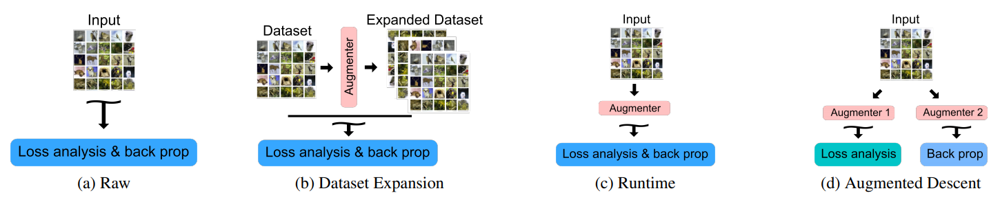

# Augmentation-for-LNL

[](https://paperswithcode.com/sota/image-classification-on-clothing1m?p=augmentation-strategies-for-learning-with)

Code for ***Augmentation Strategies for Learning with Noisy Labels*** (CVPR 2021).

**Authors**: Kento Nishi*, Yi Ding*, Alex Rich, Tobias Höllerer [`*`: equal contribution]

<details>
    <summary>Abstract</summary>
    Imperfect labels are ubiquitous in real-world datasets. Several recent successful methods for training deep neural networks (DNNs) robust to label noise have used two primary techniques: filtering samples based on loss during a warm-up phase to curate an initial set of cleanly labeled samples, and using the output of a network as a pseudo-label for subsequent loss calculations. In this paper, we evaluate different augmentation strategies for algorithms tackling the "learning with noisy labels" problem. We propose and examine multiple augmentation strategies and evaluate them using synthetic datasets based on CIFAR-10 and CIFAR-100, as well as on the real-world dataset Clothing1M. Due to several commonalities in these algorithms, we find that using one set of augmentations for loss modeling tasks and another set for learning is the most effective, improving results on the state-of-the-art and other previous methods. Furthermore, we find that applying augmentation during the warm-up period can negatively impact the loss convergence behavior of correctly versus incorrectly labeled samples. We introduce this augmentation strategy to the state-of-the-art technique and demonstrate that we can improve performance across all evaluated noise levels. In particular, we improve accuracy on the CIFAR-10 benchmark at 90% symmetric noise by more than 15% in absolute accuracy and we also improve performance on the real-world dataset Clothing1M.
</details>

<p align="center">
    
</p>

[View on arXiv](https://arxiv.org/abs/2103.02130) / [View PDF](https://arxiv.org/pdf/2103.02130.pdf) / [Download Paper Source](https://arxiv.org/e-print/2103.02130) / [Download Source Code](https://github.com/KentoNishi/Augmentation-for-LNL/archive/master.zip)

## Benchmarks
<details>
    <summary>All Benchmarks</summary>
    <h3>Key</h3>
    <table>
        <thead>
            <tr>
                <th>Annotation</th>
                <th>Meaning</th>
            </tr>
        </thead>
        <tbody>
            <tr>
                <td><code>Small</code></td>
                <td>Worse or equivalent to previous state-of-the-art</td>
            </tr>
            <tr>
                <td>Normal</td>
                <td>Better than previous state-of-the-art</td>
            </tr>
            <tr>
                <td><strong>Bold</strong></td>
                <td>Best in task/category</td>
            </tr>
        </tbody>
    </table>
    <h3>CIFAR-10</h3>
    <table>
        <thead>
            <tr>
                <th>Model</th>
                <th>Metric</th>
                <th colspan="5">Noise Type/Ratio</th>
            </tr>
            <tr>
                <th></th>
                <th></th>
                <th>20% sym</th>
                <th>50% sym</th>
                <th>80% sym</th>
                <th>90% sym</th>
                <th>40% asym</th>
            </tr>
            <tbody>
                <tr>
                    <td rowspan="2">Runtime-W (Vanilla DivideMix)</td>
                    <td>Highest</td>
                    <td><code>96.100%</code></td>
                    <td><code>94.600%</code></td>
                    <td><code>93.200%</code></td>
                    <td><code>76.000%</code></td>
                    <td><code>93.400%</code></td>
                </tr>
                <tr>
                    <td>Last 10</td>
                    <td><code>95.700%</code></td>
                    <td><code>94.400%</code></td>
                    <td><code>92.900%</code></td>
                    <td><code>75.400%</code></td>
                    <td><code>92.100%</code></td>
                </tr>
                <tr>
                    <td rowspan="2">Raw</td>
                    <td>Highest</td>
                    <td><code>85.940%</code></td>
                    <td><code></code></td>
                    <td><code></code></td>
                    <td><code>27.580%</code></td>
                    <td><code></code></td>
                </tr>
                <tr>
                    <td>Last 10</td>
                    <td><code>83.230%</code></td>
                    <td><code></code></td>
                    <td><code></code></td>
                    <td><code>23.915%</code></td>
                    <td><code></code></td>
                </tr>
                <tr>
                    <td rowspan="2">Expansion.Weak</td>
                    <td>Highest</td>
                    <td><code>90.860%</code></td>
                    <td><code></code></td>
                    <td><code></code></td>
                    <td><code>31.220%</code></td>
                    <td><code></code></td>
                </tr>
                <tr>
                    <td>Last 10</td>
                    <td><code>89.948%</code></td>
                    <td><code></code></td>
                    <td><code></code></td>
                    <td><code>10.000%</code></td>
                    <td><code></code></td>
                </tr>
                <tr>
                    <td rowspan="2">Expansion.Strong</td>
                    <td>Highest</td>
                    <td><code>90.560%</code></td>
                    <td><code></code></td>
                    <td><code></code></td>
                    <td><code>35.100%</code></td>
                    <td><code></code></td>
                </tr>
                <tr>
                    <td>Last 10</td>
                    <td><code>89.514%</code></td>
                    <td><code></code></td>
                    <td><code></code></td>
                    <td><code>34.228%</code></td>
                    <td><code></code></td>
                </tr>
                <tr>
                    <td rowspan="2">AugDesc-WW</td>
                    <td>Highest</td>
                    <td>96.270%</td>
                    <td><code></code></td>
                    <td><code></code></td>
                    <td><code>36.050%</code></td>
                    <td><code></code></td>
                </tr>
                <tr>
                    <td>Last 10</td>
                    <td>96.084%</td>
                    <td><code></code></td>
                    <td><code></code></td>
                    <td><code>23.503%</code></td>
                    <td><code></code></td>
                </tr>
                <tr>
                    <td rowspan="2">Runtime-S</td>
                    <td>Highest</td>
                    <td><strong>96.540%</strong></td>
                    <td><code></code></td>
                    <td><code></code></td>
                    <td><code>70.470%</code></td>
                    <td><code></code></td>
                </tr>
                <tr>
                    <td>Last 10</td>
                    <td><strong>96.327%</strong></td>
                    <td><code></code></td>
                    <td><code></code></td>
                    <td><code>70.223%</code></td>
                    <td><code></code></td>
                </tr>
                <tr>
                    <td rowspan="2">AugDesc-SS</td>
                    <td>Highest</td>
                    <td>96.470%</td>
                    <td><code></code></td>
                    <td><code></code></td>
                    <td>81.770%</td>
                    <td><code></code></td>
                </tr>
                <tr>
                    <td>Last 10</td>
                    <td>96.193%</td>
                    <td><code></code></td>
                    <td><code></code></td>
                    <td>81.540%</td>
                    <td><code></code></td>
                </tr>
                <tr>
                    <td rowspan="2">AugDesc-WS.RandAug</td>
                    <td>Highest</td>
                    <td>96.280%</td>
                    <td><code></code></td>
                    <td><code></code></td>
                    <td>89.750%</td>
                    <td><code></code></td>
                </tr>
                <tr>
                    <td>Last 10</td>
                    <td>96.006%</td>
                    <td><code></code></td>
                    <td><code></code></td>
                    <td>89.629%</td>
                    <td><code></code></td>
                </tr>
                <tr>
                    <td rowspan="2">AugDesc-WS.SAW</td>
                    <td>Highest</td>
                    <td>96.350%</td>
                    <td><strong>95.640%</strong></td>
                    <td>93.720%</td>
                    <td><code>35.330%</code></td>
                    <td>94.390%</td>
                </tr>
                <tr>
                    <td>Last 10</td>
                    <td>96.138%</td>
                    <td><strong>95.417%</strong></td>
                    <td>93.563%</td>
                    <td><code>10.000%</code></td>
                    <td>94.078%</td>
                </tr>
                <tr>
                    <td rowspan="2"><strong>AugDesc-WS</strong> (WAW)</td>
                    <td>Highest</td>
                    <td>96.330%</td>
                    <td>95.360%</td>
                    <td><strong>93.770%</strong></td>
                    <td><strong>91.880%</strong></td>
                    <td><strong>94.640%</strong></td>
                </tr>
                <tr>
                    <td>Last 10</td>
                    <td>96.168%</td>
                    <td>95.134%</td>
                    <td><strong>93.641%</strong></td>
                    <td><strong>91.760%</strong></td>
                    <td><strong>94.258%</strong></td>
                </tr>
            </tbody>
        </thead>
    </table>
    <h3>CIFAR-100</h3>
    <table>
        <thead>
            <tr>
                <th>Model</th>
                <th>Metric</th>
                <th colspan="4">Noise Type/Ratio</th>
            </tr>
            <tr>
                <th></th>
                <th></th>
                <th>20% sym</th>
                <th>50% sym</th>
                <th>80% sym</th>
                <th>90% sym</th>
            </tr>
            <tbody>
                <tr>
                    <td rowspan="2">Runtime-W (Vanilla DivideMix)</td>
                    <td>Highest</td>
                    <td><code>77.300%</code></td>
                    <td><code>74.600%</code></td>
                    <td><code>60.200%</code></td>
                    <td><code>31.500%</code></td>
                </tr>
                <tr>
                    <td>Last 10</td>
                    <td><code>76.900%</code></td>
                    <td><code>74.200%</code></td>
                    <td><code>59.600%</code></td>
                    <td><code>31.000%</code></td>
                </tr>
                <tr>
                    <td rowspan="2">Raw</td>
                    <td>Highest</td>
                    <td><code>52.240%</code></td>
                    <td><code></code></td>
                    <td><code></code></td>
                    <td><code>7.990%</code></td>
                </tr>
                <tr>
                    <td>Last 10</td>
                    <td><code>39.176%</code></td>
                    <td><code></code></td>
                    <td><code></code></td>
                    <td><code>2.979%</code></td>
                </tr>
                <tr>
                    <td rowspan="2">Expansion.Weak</td>
                    <td>Highest</td>
                    <td><code>57.110%</code></td>
                    <td><code></code></td>
                    <td><code></code></td>
                    <td><code>7.300%</code></td>
                </tr>
                <tr>
                    <td>Last 10</td>
                    <td><code>53.288%</code></td>
                    <td><code></code></td>
                    <td><code></code></td>
                    <td><code>2.223%</code></td>
                </tr>
                <tr>
                    <td rowspan="2">Expansion.Strong</td>
                    <td>Highest</td>
                    <td><code>55.150%</code></td>
                    <td><code></code></td>
                    <td><code></code></td>
                    <td><code>7.540%</code></td>
                </tr>
                <tr>
                    <td>Last 10</td>
                    <td><code>54.369%</code></td>
                    <td><code></code></td>
                    <td><code></code></td>
                    <td><code>3.242%</code></td>
                </tr>
                <tr>
                    <td rowspan="2">AugDesc-WW</td>
                    <td>Highest</td>
                    <td>78.900%</td>
                    <td><code></code></td>
                    <td><code></code></td>
                    <td><code>30.330%</code></td>
                </tr>
                <tr>
                    <td>Last 10</td>
                    <td>78.437%</td>
                    <td><code></code></td>
                    <td><code></code></td>
                    <td><code>29.876%</code></td>
                </tr>
                <tr>
                    <td rowspan="2">Runtime-S</td>
                    <td>Highest</td>
                    <td><strong>79.890%</strong></td>
                    <td><code></code></td>
                    <td><code></code></td>
                    <td>40.520%</td>
                </tr>
                <tr>
                    <td>Last 10</td>
                    <td>79.395%</td>
                    <td><code></code></td>
                    <td><code></code></td>
                    <td>40.343%</td>
                </tr>
                <tr>
                    <td rowspan="2">AugDesc-SS</td>
                    <td>Highest</td>
                    <td>79.790%</td>
                    <td><code></code></td>
                    <td><code></code></td>
                    <td>38.850%</td>
                </tr>
                <tr>
                    <td>Last 10</td>
                    <td><strong>79.511%</strong></td>
                    <td><code></code></td>
                    <td><code></code></td>
                    <td>38.553%</td>
                </tr>
                <tr>
                    <td rowspan="2">AugDesc-WS.RandAug</td>
                    <td>Highest</td>
                    <td>78.060%</td>
                    <td><code></code></td>
                    <td><code></code></td>
                    <td>36.890%</td>
                </tr>
                <tr>
                    <td>Last 10</td>
                    <td>77.826%</td>
                    <td><code></code></td>
                    <td><code></code></td>
                    <td>36.672%</td>
                </tr>
                <tr>
                    <td rowspan="2">AugDesc-WS.SAW</td>
                    <td>Highest</td>
                    <td>79.610%</td>
                    <td><strong>77.640%</strong></td>
                    <td>61.830%</td>
                    <td>17.570%</td>
                </tr>
                <tr>
                    <td>Last 10</td>
                    <td>79.464%</td>
                    <td><strong>77.522%</strong></td>
                    <td>61.632%</td>
                    <td>15.050%</td>
                </tr>
                <tr>
                    <td rowspan="2"><strong>AugDesc-WS</strong> (WAW)</td>
                    <td>Highest</td>
                    <td>79.500%</td>
                    <td>77.240%</td>
                    <td><strong>66.360%</strong></td>
                    <td><strong>41.200%</strong></td>
                </tr>
                <tr>
                    <td>Last 10</td>
                    <td>79.216%</td>
                    <td>77.010%</td>
                    <td><strong>66.046%</strong></td>
                    <td><strong>40.895%</strong></td>
                </tr>
            </tbody>
        </thead>
    </table>
    <h3>Clothing1M</h3>
    <table>
        <thead>
            <tr>
                <th>Model</th>
                <th>Accuracy</th>
            </tr>
            <tbody>
                <tr>
                    <td>Runtime-W (Vanilla DivideMix)</td>
                    <td><code>74.760%</code></td>
                </tr>
                <tr>
                    <td><strong>AugDesc-WS</strong> (WAW)</td>
                    <td><code>74.720%</code></td>
                </tr>
                <tr>
                    <td>AugDesc-WS.SAW</td>
                    <td><strong>75.109%</strong></td>
                </tr>
            </tbody>
        </thead>
    </table>
</details>

<details open>
    <summary>Summary Metrics</summary>
    <h3>CIFAR-10</h3>
    <table>
        <thead>
            <tr>
                <th>Model</th>
                <th>Metric</th>
                <th colspan="5">Noise Type/Ratio</th>
            </tr>
            <tr>
                <th></th>
                <th></th>
                <th>20% sym</th>
                <th>50% sym</th>
                <th>80% sym</th>
                <th>90% sym</th>
                <th>40% asym</th>
            </tr>
            <tbody>
                <tr>
                    <td rowspan="2">SOTA</td>
                    <td>Highest</td>
                    <td>96.100%</td>
                    <td>94.600%</td>
                    <td>93.200%</td>
                    <td>76.000%</td>
                    <td>93.400%</td>
                </tr>
                <tr>
                    <td>Last 10</td>
                    <td>95.700%</td>
                    <td>94.400%</td>
                    <td>92.900%</td>
                    <td>75.400%</td>
                    <td>92.100%</td>
                </tr>
                <tr>
                    <td rowspan="2"><strong>Ours</strong></td>
                    <td>Highest</td>
                    <td><strong>96.540%</strong></td>
                    <td><strong>95.640%</strong></td>
                    <td><strong>93.770%</strong></td>
                    <td><strong>91.880%</strong></td>
                    <td><strong>94.640%</strong></td>
                </tr>
                <tr>
                    <td>Last 10</td>
                    <td><strong>96.327%</strong></td>
                    <td><strong>95.417%</strong></td>
                    <td><strong>93.641%</strong></td>
                    <td><strong>91.760%</strong></td>
                    <td><strong>94.258%</strong></td>
                </tr>
            </tbody>
        </thead>
    </table>
    <h3>CIFAR-100</h3>
    <table>
        <thead>
            <tr>
                <th>Model</th>
                <th>Metric</th>
                <th colspan="5">Noise Type/Ratio</th>
            </tr>
            <tr>
                <th></th>
                <th></th>
                <th>20% sym</th>
                <th>50% sym</th>
                <th>80% sym</th>
                <th>90% sym</th>
            </tr>
            <tbody>
                <tr>
                    <td rowspan="2">SOTA</td>
                    <td>Highest</td>
                    <td>77.300%</td>
                    <td>74.600%</td>
                    <td>60.200%</td>
                    <td>31.500%</td>
                </tr>
                <tr>
                    <td>Last 10</td>
                    <td>76.900%</td>
                    <td>74.200%</td>
                    <td>59.600%</td>
                    <td>31.000%</td>
                </tr>
                <tr>
                    <td rowspan="2"><strong>Ours</strong></td>
                    <td>Highest</td>
                    <td><strong>79.890%</strong></td>
                    <td><strong>77.640%</strong></td>
                    <td><strong>66.360%</strong></td>
                    <td><strong>41.200%</strong></td>
                </tr>
                <tr>
                    <td>Last 10</td>
                    <td><strong>79.511%</strong></td>
                    <td><strong>77.522%</strong></td>
                    <td><strong>66.046%</strong></td>
                    <td><strong>40.895%</strong></td>
                </tr>
            </tbody>
        </thead>
    </table>
    <h3>Clothing1M</h3>
    <table>
        <thead>
            <tr>
                <th>Model</th>
                <th>Accuracy</th>
            </tr>
            <tbody>
                <tr>
                    <td>SOTA</td>
                    <td>74.760%</td>
                </tr>
                <tr>
                    <td><strong>Ours</strong></td>
                    <td><strong>75.109%</strong></td>
                </tr>
            </tbody>
        </thead>
    </table>
</details>

## Training Locally

All training configurations and parameters are controlled via the `presets.json` file. Configurations can contain infinite subconfigurations, and settings specified in subconfigurations always override the parent.

To train locally, first add your local machine to the `presets.json`:
```javascript
{
    // ... inside the root scope
    "machines": { // list of machines
        "localPC": { // name for your local PC, can be anything
            "checkpoint_path": "./localPC_checkpoints"
        }
    },
    "configs": {
        "c10": { // cifar-10 dataset
            "machines": { // list of machines
                "localPC": { // local PC name
                    "data_path": "/path/to/your/dataset"
                    // path to dataset (python) downloaded from:
                    // https://www.cs.toronto.edu/~kriz/cifar.html
                }
                // ... keep all other machines unchanged
            }
            // ... keep all other config values unchanged
        }
        // ... keep all other configs unchanged
    }
    // ... keep all other global values unchanged
}
```

A "preset" is a specific configuration branch. For example, if you would like to run `train_cifar.py` with the preset  `root -> c10 -> 90sym -> AugDesc-WS` on your machine named `localPC`, you can run the following command:
```bash
python train_cifar.py --preset c10.90sym.AugDesc-WS --machine localPC
```
The script will begin training the preset specified by the `--preset` argument. Progress will be saved in the appropriate directory in your specified `checkpoint_path`. Additionally, if the `--machine` flag is ommitted, the training script will look for the dataset in the `data_path` inherited from parent configurations.


## Citations
Please cite the following (temporary arXiv citation):
```
@ARTICLE{2021arXiv210302130N,
       author = {{Nishi}, Kento and {Ding}, Yi and {Rich}, Alex and {H{\"o}llerer}, Tobias},
        title = "{Augmentation Strategies for Learning with Noisy Labels}",
      journal = {arXiv e-prints},
     keywords = {Computer Science - Computer Vision and Pattern Recognition},
         year = 2021,
        month = mar,
          eid = {arXiv:2103.02130},
        pages = {arXiv:2103.02130},
archivePrefix = {arXiv},
       eprint = {2103.02130},
 primaryClass = {cs.CV},
       adsurl = {https://ui.adsabs.harvard.edu/abs/2021arXiv210302130N},
      adsnote = {Provided by the SAO/NASA Astrophysics Data System}
}
```

## Additional Info
This repository is a fork of [the official DivideMix implementation](https://github.com/LiJunnan1992/DivideMix).